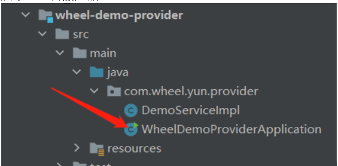
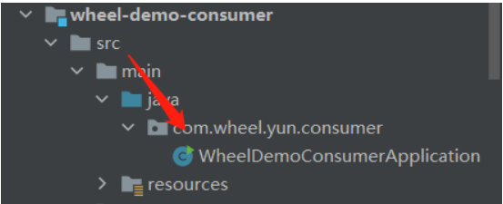

# 前言：
如果你还在为课设因为没有项目或者校招没有项目而烦恼，或许你还在嫌弃一些烂大街的项目时，我想说该项目可能会适合你。如果你想了解该项目，您可能需要一些前置知识，比如你了解什么是微服务，你或许使用过Dubbo或者了解SpringCloud，又或许你还了解Rpc远程过程调用，又或许你稍微看了一下Spring与Dubbo的通用源码，那么我相信该项目非常的适合你，而且，我也需要你与我的参与一起完善该项目。我相信你的逻辑能力应该能让这个项目发散更多的闪光点。
尽管现在Rpc项目也是越来越多了，但是就目前免费公布的一些源码，它们的实现仅仅是一个Rpc调用，这样的代码量是非常少的，而且项目也算是一个微型项目，然而该项目的功能还是相对比较完善的，当然，我需要你的参与让这个项目更加完善。同时，我也需要你的star，让这个项目被更多人知道。如果你非常感兴趣的话，请访问链接[https://github.com/yunlong826/wheel4j](https://github.com/yunlong826/wheel4j) star一下，并联系我(qq:1653812264,备注来源)，那么我们就可以一起参与该项目了。
# 3. 工程简介
   该项目模仿Dubbo，主要是基于Spring容器开发的一款简易版的Dubbo。使用者可以通过XML或者注解的方式进行配置相应信息。该项目使用Zookeeper作为注册中心，并且采用Netty框架进行RPC通信。该项目的主要模块如下：
   
# 4. 搭建教程
   读者可以clone源码到本地（JDK1.8），然后本地启动zookeeper服务器（确保本地zk是可用的即可）
    

打开wheel-demo模块：

启动生成者服务器：

启动后，出现下列类似日志即为成功：

启动消费者服务器:

出现以下类似日志即为成功：

# 5. 参考资料
[https://github.com/yunlong826/dubbo](https://github.com/yunlong826/dubbo)
[https://github.com/yunlong826/guide-rpc-framework](https://github.com/yunlong826/guide-rpc-framework)
[https://github.com/jessin20161124/miniDubboOpen](https://github.com/jessin20161124/miniDubboOpen)