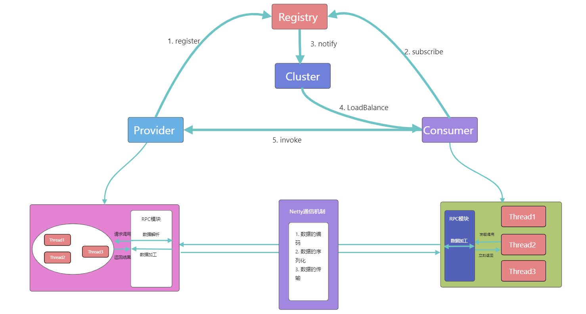
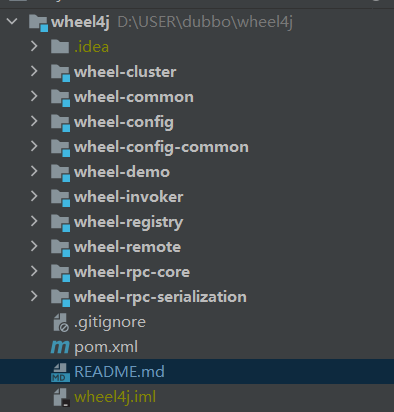
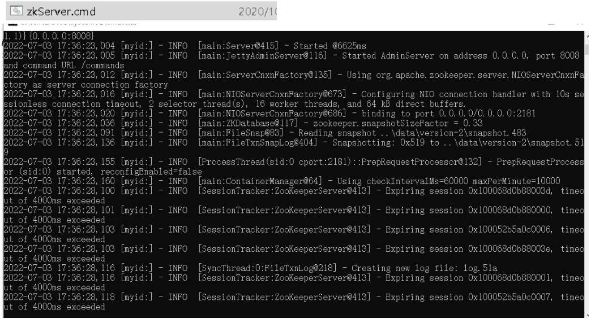
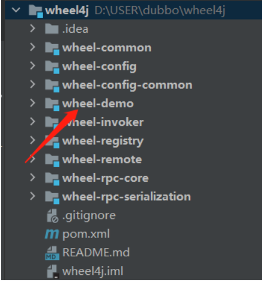
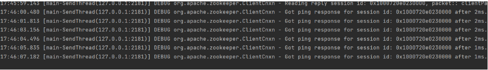
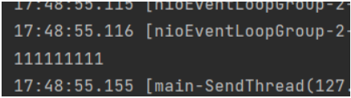
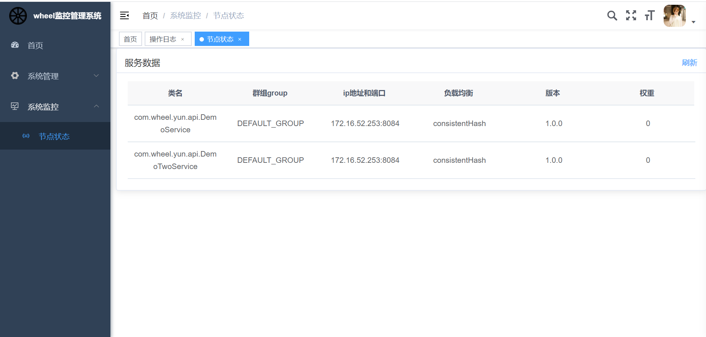

## Star History

# 前言：
如果你还在为课设因为没有项目或者校招没有项目而烦恼，或许你还在嫌弃一些烂大街的项目时，我想说该项目可能会适合你。如果你想了解该项目，您可能需要一些前置知识，比如你了解什么是微服务，你或许使用过Dubbo或者了解SpringCloud，又或许你还了解Rpc远程过程调用，又或许你稍微看了一下Spring与Dubbo的通用源码，那么我相信该项目非常的适合你，而且，我也需要你与我的参与一起完善该项目。我相信你的逻辑能力应该能让这个项目发散更多的闪光点。

尽管现在Rpc项目也是越来越多了，但是就目前免费公布的一些源码，它们的实现仅仅是一个Rpc调用，这样的代码量是非常少的，而且项目也算是一个微型项目，然而该项目的功能还是相对比较完善的，当然，我需要你的参与让这个项目更加完善。同时，我也需要你的star，让这个项目被更多人知道。如果你非常感兴趣的话，请访问链接[https://github.com/yunlong826/wheel4j](https://github.com/yunlong826/wheel4j)与[ https://github.com/TangBaoliang/wheel-admin-ui]( https://github.com/TangBaoliang/wheel-admin-ui)(前端项目) star一下，并联系我(qq:1653812264,备注来源)，那么我们就可以一起参与该项目了。
## 前置知识
1. 熟练搭建分布式项目
2. 了解分布式相关原理
3. 粗读过Spring源码/Dubbo源码
4. 了解Zookeeper/Netty的使用
5. Rpc相关原理
# 1. 已完成功能列表
- [x] 支持服务端多个Api暴露
- [x] 支持消费端对暴露的Api进行调用
- [x] 基于netty+json序列化通信
- [x] zk、netty连接复用
- [x] netty心跳保活机制
- [x] 支持消费端调用服务的负载均衡
- [x] 支持多个负载均衡策略（哈希一致性、最少活跃次数、加权随机、加权轮询）
- [x] 支持api的多个版本暴露
- [x] 服务端请求线程池实现
- [x] 服务端优雅启动，在spring容器将所有要加装的bean加载到容器后，再注册到zookeeper上
- [x] 服务端优雅下线，在spring容器销毁前，先从zookeeper取消注册，最后关闭客户端连接。
- [x] 支持注解方式配置
- [x] 支持application.properties文件配置注册中心与protocol
- [x] 实现wheel-admin模块，用户可以通过可视化界面进行服务查看
- [x] wheel-admin模块使用Spring Security框架进行权限认证
- [x] wheel-admin模块实现了日志追踪
# 2. 待办
- [ ]  支持多个序列化协议
- [ ]  其他注册中心的支持 （redis）
- [ ]  项目性能优化与代码结构优化
  .......
# 3. 工程简介
## 3.1 构建
   

   该项目模仿Dubbo，主要是基于Spring容器开发的一款简易版的Dubbo。使用者可以通过XML或者注解的方式进行配置相应信息。该项目使用Zookeeper作为注册中心，并且采用Netty框架进行RPC通信。该项目的主要模块如下：

   
# 4. 搭建教程
   读者可以clone源码到本地（JDK1.8），然后本地启动zookeeper服务器（确保本地zk是可用的即可）

   

打开wheel-demo模块：

启动生成者服务器：

启动后，出现下列类似日志即为成功：

启动消费者服务器:

出现以下类似日志即为成功：

# 5. Wheel-admin模块
wheel-admin模块与其他模块没有任何依赖关系，上述搭建成功后，可以启动wheel-admin模块，通过前端可视化界面展示相关服务信息。 
前端项目详细地址: [https://github.com/TangBaoliang/wheel-admin-ui](https://github.com/TangBaoliang/wheel-admin-ui)  
上述都启动成功后，前端页面关于节点监控将会展示出来：

# 6. 参考资料
1. [https://github.com/apache/dubbo](https://github.com/apache/dubbo)

2. [https://github.com/Snailclimb/guide-rpc-framework](https://github.com/Snailclimb/guide-rpc-framework)

3. [https://github.com/jessin20161124/miniDubboOpen](https://github.com/jessin20161124/miniDubboOpen)
